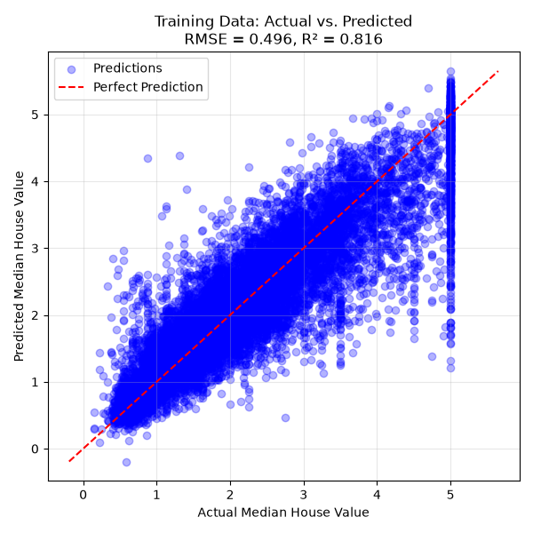
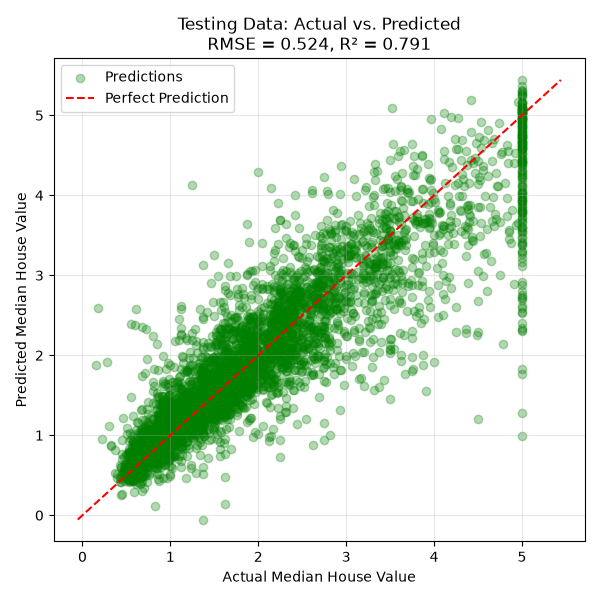

# A02-iym24004-sah24002

Our live attempt to do the Ping Pong assignment 

Hey It's Parvathi & Sabereen- Welcome to our repo!

# California Housing Price Prediction
## Project Overview

This project uses the California Housing dataset from `scikit-learn` to train a regression model that predicts median house values.

The project performs the following steps:

- Loads the California Housing dataset
- Separates the features and target variable
- Splits the data into training and testing datasets
- Scales the features using `StandardScaler`
- Trains an `MLPRegressor` neural-network model
- Uses early stopping to prevent unnecessary training
- Generates predictions for the training and testing data
- Calculates RMSE and R-squared evaluation metrics
- Saves actual-versus-predicted plots

## Partners

- Sabereen Faruque Safa (sah24002)
- Parvathi Meghanath (iym24004)

## Project Structure

```text
A02-iym24004-sah24002/
├── figures/
│   ├── med_house_value_boxplot.png
│   ├── train_actual_vs_pred.png
│   └── test_actual_vs_pred.png
├── src/
│   └── ds_pipeline.py
├── README.md
└── requirements.txt
```

## Model

The project uses an `MLPRegressor` with the following settings:

- Hidden layers: `(64, 32)`
- Learning rate: `0.001`
- Maximum iterations: `500`
- Early stopping: enabled
- Random state: `42`

`StandardScaler` and `MLPRegressor` are combined in a scikit-learn pipeline.

## How to Run the Project

### 1. Clone the repository

```bash
git clone https://github.com/iym24004/A02-iym24004-sah24002
```

### 2. Enter the project folder

```bash
cd A02-iym24004-sah24002
```

### 3. Install the required packages

```bash
python -m pip install -r requirements.txt
```

### 4. Run the Python program

Run this command from the main repository folder:

```bash
python src/ds_pipeline.py
```

The program will train the model, display the evaluation results in the terminal and save the figures in the `figures` folder.

## Model Training Code

The complete model-training code is available here:

[`src/ds_pipeline.py`](src/ds_pipeline.py)

## Training Predictions

The following plot compares the actual and predicted house values using the training dataset:



## Testing Predictions

The following plot compares the actual and predicted house values using the testing dataset:



## Collaboration

Both partners contributed through separate Git branches and pull requests. Each pull request was reviewed and approved by the other partner before being merged into `main`. Merged branches were deleted after completion.
